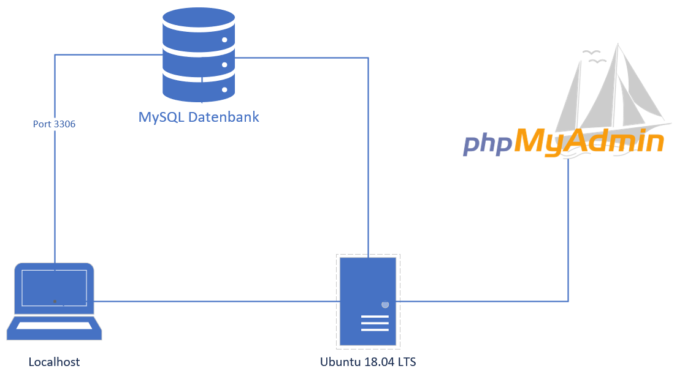

# M300-LB2 Dokumentation

---

# Inhaltsverzeichnis

- [Einführung](#einführung)
- [Grafische Übersicht des Services](#grafische)
- [Quellenangaben](#quellenangaben)
- [Vagrantfile](#vagrantfile)
- [Bootstrap.sh](#bootstrap)
- [Service Anwendung](#anwendung)
- [Service testen](#testen)

---

# Einführung

Wir haben im Modul 300 den Auftrag bekommen, ein eigenes Projekt mit Vagrant zu gestallten.
Mein Projekt ist, dass man ein MySQL automatisch einrichten lassen kann.

---

# Grafische Übersicht des Services

---

# Quellenangaben

Da ich noch nie so ein Projekt gemacht habe, habe ich mir im Internet eine Anleitung rausgesucht. Diese findet man unter diesem Link [HIER](https://www.yourtechy.com/technology/mysql-server-vagrant-virtualbox/).
Da ich nicht alles eins zu eins übernehmen wollte, habe ich einige Anpassungen am Skript vorgenommen.Damit es angenehmer ist die MySQL-Datenbank und ihre User zu verwalten und zu konfigurieren
habe ich mich entschieden noch einen GUI mit einzubinden. Zu diesem Zweck verwenden ich das webbasierte 
phpmyadmin.

Dies möchte ich Ihnen aber weiter unten genauer erklären.

# Vagrantfile

Hier unten finden Sie noch mein Vagrantfile:

    Vagrant.configure("2") do |config|
    
      # General Vagrant VM configuration
      config.vm.box = "ubuntu/bionic64"

      config.vm.define "db-server" do |db|
        db.vm.network :forwarded_port, guest: 3306, host: 3306
        db.vm.network :forwarded_port, guest: 80, host: 3306
        db.vm.provision "shell", path: "bootstrap.sh"
      end

      # Adjustment for VM
      config.vm.provider :virtualbox do |vb|
        vb.customize [
            'modifyvm', :id,
            '--natdnshostresolver1', 'on',
            '--memory', '1024',
            '--cpus', '4'
        ] 
      end
    end

| Code| Beschreibung|
| --------------| -----------------|
| Vagrant.configure("2") do config | Diese Zeile im Code beschreibt die API Ausführung, hierbei die Menge 2, vom Vagrantfile. In diesem Block beschreibe ich die VM Konfigurationen die ich vornehmen werde.  |
| config.vm.box | Hier habe ich mich für ein Betirebssystem entscheiden, welches ich auf der VM laufen haben will.  |
| db.vm.network | Da definiere ich den Port auf welchen darauf folgend die VM zugreift. In diesem Zusammenhang wäre es für MySQL Port 3306 und für die Webapplikation phpmyadmin Port 80.  |
| db.vm.provision | In diesem Schritt erlaube ich die Variation von einem Shell Skript, in meinem Fall das bootstrap.sh file, nachdem das Guest OS gebootet hat.
| config.vm.provider :virtualbox do vb |  Hier definiere ich den Provider der VM, hierbei Virtualbox. Außerdem habe ich noch Anpassungen gemacht, z.b mehr RAM und CPUs.  |
